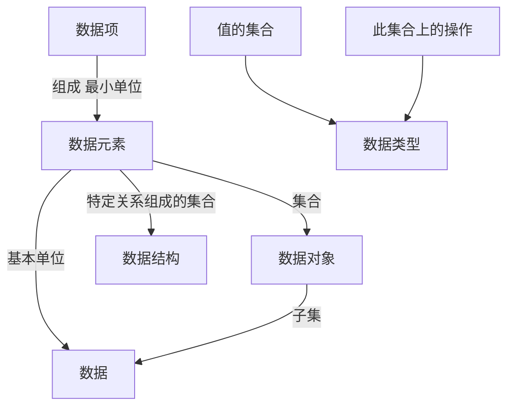

---
categories:
- undefined
date: 2023-05-15 14:13:57
sticky: 100
tags:
- visit
- root
- int
- tree
- pattern
title: 408读书笔记
---

> 

<!--more-->

# 数据结构

## 第1章绪论
### 1.1      数据结构的基本概念
#### 1.1.1 基本概念和术语 



#### 1.1.2 数据结构三要素 
数据结构包括三方面的内容：逻辑结构、存储结构和数据的运算。

逻辑结构: 线性非线性

存储结构: 顺序存储, 链式存储, 索引存储, 散列存储

### 1.2 算法和算法评价 
#### 1.2.1 算法的基本概念 
5 个特性: 有穷性, 确定性, 可行性, 输入, 输出

#### 1.2.2 算法效率的度量 
## 第2章 .线性表 
### 2.1 线性表的定义和基本操作
查找: 区分按值查找, 按序号查找

#### 2.1.1 线性表的定义 
定义: 具有相同数据类型的有限序列, 逻辑上有先后次序, 是一种逻辑结构

#### 2.1.2 线性表的基本操作 
### 2.2 线性表的顺序表示 
#### 2.2.1 顺序表的定义  
定义: 线性表达的顺序存储

特点: 随机访问, 增删需要移动元素

#### 2.2.2顺序表上基本操作的实现
### 2.3 线性表的链式表示 
#### 2.3.1 单链表的定义 
非随机存取

可以设置头结点, 数据为空, 好处: 统一了第一个位置上的操作, 统一了空与非空的操作

#### 2.3.2 单链表上基本操作的实现 
#### 2.3.3 双链表  
#### 2.3.4 循环链表 
#### 2.3.5 静态链表 
用数组描述线性表的链式存储结构, 此时的指针是结点的相对地址(数组下标)


#### 2.3.6 顺序表和链表的比较
## 第3章栈、队列和数组 
### 3.1 栈
#### 3.1.1 栈的基本概念 
卡特兰数: n 个不同元素进栈, 出栈元素不同排列的个数为 

$$\frac{1}{n-1}C^{n}_{2n}$$

#### 3.1.2 栈的顺序存储结构 
共享栈


#### 3.1.3 栈的链式存储结构 
### 3.2队列 
#### 3.2.1 队列的基本概念， 
front队头: 删除端

rear队尾: 插入端

#### 3.2.2 队列的顺序存储结构  
循环队列

区分队空还是满: 一般牺牲一个单元来区分, 约定: 队头指针在队尾指针的下一位置作为队满的标志

#### 3.2.3 队列的链式存储结构 
#### 3.2.4 双端队列 
### 3.3 栈和队列的应用 
#### 3.3.1 栈在括号匹配中的应用 
#### 3.3.2 栈在表达式求值中的应用 
#### 3.3.3 栈在递归中的应用 
#### 3.3.4 队列在层次遍历中的应用 
用队列遍历二叉树

#### 3.3.5 队列在计算机系统中的应用 
### 3.4 数组和特殊矩阵 
#### 3.4.1 数组的定义 
#### 3.4.2 数组的存储结构  
按行优先: 00 01 02...10 11 12...从左到右, 从上到下

按列优先 00 10 20 ... 01 11 21 ... 从上到下, 从左到右

#### 3.4.3 特殊矩阵的压缩存储 
对称矩阵 序号公式?

三角矩阵 +1 常数

对角矩阵(条带状)

#### 3.4.4 稀疏矩阵 
三元组:(行标, 列表, 非零值)

十字链表法?

## 第4章串。 
### *4.1 串的定义和实现 
#### 4.1.1 串的定义． 
#### 4.1.2 串的存储结构 
#### 4.1.3 串的基本操作 
#### 4.2 串的模式匹配. 
#### 4.2.1 简单的模式匹配算法 
#### 4.2.2 串的模式匹配算法-KMP 算法. 
右移位数 = 已匹配的字符数 - 对应的部分匹配值, 
再将匹配值右移, 并以 -1 开始

```
char:  | a | b | a | b | a | b | c | a |
index: | 0 | 1 | 2 | 3 | 4 | 5 | 6 | 7 | 
value: | 0 | 0 | 1 | 2 | 3 | 4 | 0 | 1 |
the value means: The length of the longest proper prefix in the (sub)pattern that matches a proper suffix in the same (sub)pattern.
That means we get to skip ahead 

partial_match_length - 
table[partial_match_length - 1] 

(or 5 - table[4] or 5 - 3 or 2) characters
```


```c++

class Solution {
  public:
    int strStr(string src_str, string pattern_str) {
        int src_length = src_str.length();
        int pattern_length = pattern_str.length();

        vector<int> next(pattern_length, 0);
        int i = 1, now = 0;
        while (i < pattern_length) {
            if (pattern_str[i] == pattern_str[now]) {
                now++;
                next[i] = now;
                i++;
            } else if (now != 0) {
                now = next[now - 1]; //根据之前的结果得到的
            } else {
                next[i] = 0;
                i++;
            }
        }

        int src_index = 0, pattern_index = 0;
        while (src_index < src_length) {
            if (src_str[src_index] == pattern_str[pattern_index]) {
                src_index++;
                pattern_index++;
            } else if (pattern_index != 0) {
                pattern_index = next[pattern_index - 1];
            } else {
                src_index++;
            }

            if(pattern_index == pattern_length)
                return src_index - pattern_index ;
        }
        return -1;
    }
};
```


#### 4.2.3 KMP 算法的进一步优化 
## 第5章 树与二叉树 
### 5.1 树的基本概念
#### 5.1.1 树的定义 
#### 5.1.2 基本术语 
结点的度: 一个结点孩子的度数

数的度: 树中结点的最大度数

度>0 为分支结点, 度=0 为叶结点

结点的深度: 根结点深度为 1, 从根结点到叶结点累加

结点的高度: 从叶结点到根结点累加

树的高度: 树的最大层数

路径长度: 路径上经过的**边**的个数

#### 5.1.3 树的性质 
 $$树的结点数 =\sum{结点度数} +1$$

度为 m 的树第 i 层上至多有 $$m^{i-1}$$个结点

高度为 h 的 m 叉树至多有$$\frac{(m^{h}-1)}{m-1}$$个结点($$S=m^{h-1}+m^{h-2}+...+m+1$$)

具有n 个结点的 m 叉树的最小高度为$$\lceil log_m(n(m-1)+1) \rceil$$ (取自前一结论)


### 5.2 二叉树的概念 
#### 5.2.1 二叉树的定义及其主要特性 
满二叉树: 满的二叉树

完全二叉树: 满二叉树删去"倒数的几个节点"

二叉排序树: 左子树小于根节点, 右子树大于根节点, 子树同上

平衡二叉树: 树上任意节点的左右子树深度之差<=1

二叉树的性质

- $$n_0 = n_2 +1$$
- 完全二叉树从上到下, 从左到右, 从 1 到 n, 对于节点 i
  - $$parent = \lfloor\frac i 2\rfloor$$
  - $$leftchild = 2i$$ $$rightchild = 2i+1$$
  - $$depth = \lfloor log_2 i +1 \rfloor$$


#### 5.2.2 二叉树的存储结构 
### 5.3 二叉树的遍历和线索二叉树 
#### 5.3.1 二叉树的遍历 
```c++

typedef int value_t;
class BiTree {
  public:
    BiTree* lchild;
    BiTree* rchild;
    value_t value;
};

void visit(BiTree* pt) {
    // cout value
}

void PreOrderRecur(BiTree* p_bitree) {
    if (p_bitree != nullptr) {
        visit(p_bitree);
        PreOrderRecur(p_bitree->lchild);
        PreOrderRecur(p_bitree->rchild);
    }
}

void PreOrderIt(BiTree* p_bitree) {
    BiTree* p = p_bitree;
    stack<BiTree*> s;
    while (!p || !s.empty()) {
        if (p) {
            visit(p);
            s.push(p);
            p = p->lchild;
        } else {
            p = s.top();
            s.pop();
            p = p->rchild;
        }
    }
}

void InOrderRecur(BiTree* p_bitree) {
    if (p_bitree != nullptr) {
        InOrderRecur(p_bitree->lchild);
        visit(p_bitree);
        InOrderRecur(p_bitree->rchild);
    }
}

void InOrderIt(BiTree* p_bitree) {
    BiTree* p = p_bitree;
    stack<BiTree*> s;
    while (!p || !s.empty()) {
        if (p) {
            s.push(p);
            p = p->lchild;
        } else {
            p = s.top();
            s.pop();
            visit(p);
            p = p->rchild;
        }
    }
}

void PostOrderRecur(BiTree* p_bitree) {
    if (p_bitree != nullptr) {
        PostOrderRecur(p_bitree->lchild);
        PostOrderRecur(p_bitree->rchild);
        visit(p_bitree);
    }
}


void PostOrderIt(BiTree* p_bitree) {
    BiTree* p = p_bitree;
    BiTree* recent_visited = nullptr;
    stack<BiTree*> s;
    while (!p || !s.empty()) {
        if (p) {
            s.push(p);
            p = p->lchild;
        } else {
            p = s.top();
            if (p->rchild && p->rchild != recent_visited) {
                p = p->rchild;
            } else {
                s.pop();
                visit(p);
                recent_visited = p;
                p = nullptr;
            }
        }
    }
}

void LevelOrder(BiTree* p_bitree) {
    BiTree* p = p_bitree;
    queue<BiTree*> q;
    q.push(p);
    while (!q.empty()) {
        p = q.front();
        q.pop();
        visit(p);
        if(p->lchild)
            q.push(p->lchild);
        if(p->rchild)
            q.push(p->rchild);
    }
}
```

根据遍历结果构造二叉树

#### 5.3.2 线索二叉树 ???
规定: 若无左子树, lchild 指向前驱节点, 若无右子树, rchild 指向后继节点, ltag=1 代表前驱, rtag=1 代表后继

```cpp

class ThreadBiTree {
  public:
    ThreadBiTree* lchild;
    ThreadBiTree* rchild;
    bool ltag;
    bool rtag;
    value_t value;
};

void visit(ThreadBiTree* p) {}

void InThread(ThreadBiTree* p, ThreadBiTree* pre) {
    if (p != nullptr) {
        InThread(p->lchild, pre);
        if (p->lchild == nullptr) {
            p->lchild = pre;
            p->ltag = true;
        }
        if (pre != nullptr && pre->rchild == nullptr) {
            pre->rchild = p;
            pre->rtag = true;
        }
        pre = p;
        InThread(p->rchild, pre);
    }
}

void CreateInThread(ThreadBiTree* t) {
    ThreadBiTree* pre = nullptr;
    if (t != nullptr) {
        InThread(t, pre);
        pre->rchild = nullptr;
        pre->rtag = 1;
    }
}

ThreadBiTree* FirstNode(ThreadBiTree* p) {
    while (p->ltag == false)
        p = p->lchild;
    return p;
}

ThreadBiTree* NextNode(ThreadBiTree* p) {
    if (p->rtag == false)
        return FirstNode(p->rchild);
    else
        return p->rchild;
}

void InOrderThread(ThreadBiTree* t) {
    for (ThreadBiTree* p = FirstNode(t); p != nullptr; p = NextNode(p))
        visit(p);
}
```


### 5.4 树、森林 
#### 5.4.1 树的存储结构 

双亲表示法

```c++
typedef struct{
  ElemType data;
  int parent
} OTNode;
//root's parent = -1
typedef struct{
  PNTNode nodes[MAX_SIZE];
  int n;
}PTree;
```

孩子表示法

```
  ┌─┬─┐    ┌─┐     ┌─┐        
  │0│R│───▶│1│────▶│2│        
  │1│A│    └─┘     └─┘        
  │2│B│                       
  │3│C│    ┌─┐                
  │4│D│───▶│6│                
  │5│E│    └─┘                
  │6│F│                       
  ├───┼                                              
```

孩子兄弟表示法(二叉树表示法)

```c++
typedef struct CSNode{
  ElemType data;
  struct CSNode * firstchild, *nextsibling;
} CSNode, *CSTree;
//nextsibling 是本节点的兄弟节点的指针
```

#### 5.4.2 树、森林与二叉树的转换 

树->二叉树(唯一)

每个节点左指针指向第一个孩子, 右指针指向本节点相邻的右兄弟(左孩子右兄弟)

森林->二叉树(唯一)

现将每棵树转换为二叉树, 将树的根节点彼此视为兄弟连接到右指针上

#### 5.4.3 树和森林的遍历  

树遍历

- 先根遍历, 先访问根节点,再访问每棵子树, 类似对应二叉树的先序遍历
- 后根遍历, 先遍历子树再访问根节点, 类似对应二叉树的中序遍历

森林遍历

- 先序遍历, 先访问根节点,再访问每棵子树, 类似对应二叉树的先序遍历
- 中序遍历(也叫后序遍历), 先遍历子树再访问根节点, 类似对应二叉树的中序遍历

### 5.5树与二叉树的应用 
#### 5.5.1 哈夫曼树和哈夫曼编码  

带权路径长度

$$WPL = \sum_{i=1}^{n}{w_il_i}$$

$w_i$为第 i 叶节点的权值, $l_i$为该叶节点到根节点的路径长度

WPL 最小的二叉树成为哈夫曼树(最优二叉树)

构造哈夫曼树


哈夫曼编码是一种可变长度编码, 使用频率越高长度越短


哈夫曼树不一定唯一(左右子树是 0 或 1 不规定; 有相同权值的节点. 但所有哈夫曼树最后的 WPL 是相同的)

#### 5.5.2. 并查集???

并查集是一种简单的集合表示

## 第6章图 
### 6.1 图的基本概念 
#### 6.1.1 图的定义

简单图: 如果图满足: 不存在重复边, 不存在顶点到自身的边

完全图: 每两个顶点之间都存在边(有向图则需要两条边)

子图: 顶点和边都是子集

生成子图: 顶点相同, 边是子集

连通图: 无向图中任意顶点都是连通的, 无向图中的极大连通子图称为连通分量

强连通图: 有向图中任意中任意顶点都是连通的, 有向图中的极大强连通子图称为连通分量

生成树: 连通图的生成树是包含全部顶点的一个极小连通子图, 对生成树而言, 去掉一条边就会变成非连通图, 加上一条边就会出现回路

生成森林: 非连通图中连通分量的生成树构成了飞连通图的生成森林

带权图又称网

稀疏图稠密图: 当满足$|E|<|V|log|V|$ 可视为稀疏图

路径长度: 路径上边的个数

简单路径: 顶点不重复出现的路径

距离: 最短路径的长度

有向树: 一个顶点入度=0, 其余顶点入度=1 的有向图称为有向树

### 6.2 图的存储及基本操作 
#### 6.2.1 邻接矩阵法  

```c++
#define MaxVertexNum 100
typedef int EdgeType;
typedef char VertexType;
typedef struct {
    VertexType vex[MaxVertexNum];
    EdgeType edge[MaxVertexNum][MaxVertexNum];
    int vexnum, arcnum;
} MGraph;
```

适用于稠密图

无向图只需存储三角矩阵的元素

$A^n$的元素$A^n[i][j]$等于从 i 到 j 顶点长度为 n 的路径的数量

难以数出边的数量

#### 6.2.2 邻接表法  

```cpp
#define MaxVertexNum 100
typedef int EdgeType;
typedef char VertexType;

typedef struct ArcNode {
    int adjvex;
    struct ArcNode* next;
    // EdgeType weight
} ArcNode;

typedef struct VNode {
    VertexType data;
    ArcNode* first;
} VNode, AdjList[MaxVertexNum];

typedef struct {
    AdjList vertices;
    int vexnum, arcnum;
} ALGraph;
```

无向图的存储中会有重复

难以判断两顶点之间是否存在边

有向图存储的是出度边, 难以数出入度

邻接表不唯一

#### 6.2.3 十字链表(有向图)

```cpp
typedef struct ArcNode{
  int tailvex;//弧头顶点编号
  int headvex;//弧尾顶点编号
  ArcNode* hlink;//弧头相同的下一个弧节点
  ArcNode* tlink;//弧尾相同的下一个弧节点
  Data info;
} ArcNode;

typedef struct VexNode{
  Data data;
  ArcNode* firstin;//以本顶点为弧头的第一个弧
  ArcNode* firstout;//以本顶点为弧尾的第一个弧
}
```


#### 6.2.4 邻接多重表(无向图)

```cpp
typedef struct ArcNode{
  int ivex;//顶点编号
  int jvex;//顶点编号
  ArcNode* ilink;//ivex相同的下一个弧节点
  ArcNode* jlink;//jvex相同的下一个弧节点
  Data info;
} ArcNode;

typedef struct VexNode{
  Data data;
  ArcNode* firstedge//第一条边
}
```


#### 6.2.5 图的基本操作 
### 6.3 图的遍历 

访问每一个顶点

#### 6.3.1 广度优先搜索  BFS

```cpp
vector<bool> visited(MAX, false);
queue<DataType> q;
void BFS(Graph g, int v){
    visit(v);
    visited[v] = true;
    q.push(v);
    while(!q.empty()){
        v = q.front();
        q.pop();
        for(int w = FirstNeighbor(g, v); w>=0; w = NextNeighbor(g, v, w))
        if(!visited[w]){
            visit(w);
            visited[w] = true;
            q.push(w);
        }
    }
}

void BFSTraverse(Graph g){
    for(int i=0; i<g; i++)
        if(!visited[i])
            BFS(g, i);
}
```

空间复杂度: S(V)

邻接表时间复杂度: O(V+E)

邻接矩阵时间复杂度: O(V^2^)

BFS求单源最短路径

```cpp
#define Max_Distance 10e9
void BFSminDistance(Graph g, int u){
    vector<int> distance(max_vex_count, Max_Distance);
    vector<bool> visited(max_vex_count, false);
    visited[u] = true;
    distance[u] = 0;
    queue<int> q;
    q.push(u);
    while(!q.empty()){
        u = q.front();
        q.pop();
        for(int w = FirstNeighbor(g, u); w>=0; w = NextNeighbor(g, u, w))
        if(!visited[w]){
            visited[w] = true;
            distance[w] = distance[u] + 1;
            q.push(w);
        }
    }
}
```

广度生成树

#### 6.3.2 深度优先搜索  DFS

```cpp
vector<bool> visited(MAX, false);
void DFS(Graph g, int v) {
    visit(v);
    visited[v] = true;
    for (int w = FirstNeighbor(g, v); w >= 0; w = NextNeighbor(g, v, w))
        if (!visited[w]) {
            DFS(g, w);
        }
}

void DFSTraverse(Graph g) {
    for (int i = 0; i < g; i++)
        if (!visited[i])
            DFS(g, i);
}
```

空间复杂度: S(V) 运行栈

邻接表时间复杂度: O(V+E)

邻接矩阵时间复杂度: O(V^2^)

#### 6.3.3 图的遍历与图的连通性 

对于无向图, 以上两种遍历方法调用 BFS(DFS)函数的次数 = 图的连通分量数

### 6.4 图的应用 
#### 6.4.1 最小生成树

边的权值之和最小的生成树称为最小生成树

当各边权值不相等时, 最小生成树唯一, 树的最小生成树是自己本身

最小生成树的边数=顶点数-1

- 通用方法

  ```pseudocode
  get_min_generate_tree(g)
  	tree = null
  	while tree isnot generate_tree
  		do:
  			找到一条权重最小边(u, v),
        并且加入 tree 后无回路
  			tree = tree+(u, v)
  ```

- Prim 算法

  ```pseudocode
  Prim(g, tree)
  	tree = null
  	V_tree = {w} # any vertex as w
  	while V-V_tree != null:
  		find (u, v)where:
        u isin V_tree, 
        v isin V-V_tree, 
        and (u, v) is min
  		Tree = Tree + (u, v)
  		V_tree = V_tree + v
  ```

  O(V^2^)

- Kruskal 算法

  ```pseudocode
  Kruskal(V, tree)
  	tree = V
  	# connected component 连通分量
  	connect_cp_count = n
  	while connect_cp > 1:
  		find min(u, v) in E
  		if u, v isin different conncted component:
  			tree = tree + (u, v)
  			connect_cp_count--
  ```

  

#### 6.4.2 最短路径 

##### dijkstra 算法 单源

邻接矩阵时间复杂度: O(V^2^)

邻接表时间复杂度: O(V^2^)

有边权值为负时, 不适用

```cpp
#include <vector>
using namespace std;
class Solution {
  public:
    int
    dijkstra(vector<vector<int>>& adj_matrix, int vertex_cnt, int src_vertex) {
        const int inf = INT_MAX / 2;
        vector<vector<int>> g(vertex_cnt, vector<int>(vertex_cnt, inf));
        for (auto& t : adj_matrix) {
            int x = t[0] - 1, y = t[1] - 1;
            g[x][y] = t[2];
        } // 邻接表转换到邻接矩阵

        vector<int> dist(vertex_cnt, inf);
        dist[src_vertex - 1] = 0;
        vector<bool> used(vertex_cnt, false);

        for (int i = 0; i < vertex_cnt; ++i) {
            int x = -1;
            for (int y = 0; y < vertex_cnt; ++y) {
                if (!used[y] && (x == -1 || dist[y] < dist[x])) {
                    x = y;
                }
            }
            used[x] = true;
            for (int y = 0; y < vertex_cnt; ++y) {
                dist[y] = min(dist[y], dist[x] + g[x][y]);
            }
        }

        int ans = *max_element(dist.begin(), dist.end());
        return ans == inf ? -1 : ans;
    }
};

```


##### floyd 算法 多源

$A^k[i][j] = Min\{A^{k-1}[i][j], A^{k-1}[i][k] + A^{k-1}[k][j]\}$

循环 n 次(n 为顶点数)

#### 6.4.3 有向无环图描述表达式 

有向无环图 DAG (Directed Acyclic Graph)

#### 6.4.4 拓扑排序 

AOV 网(Activity on Vertex Network) 有向边\<V~i~, V~j~\>表示 i 活动优先于 j 活动

拓扑排序: 在有向无环图中, 每个顶点之出现一次, A 在 B 前则不存在从 B 到 A 的路径
步骤: 

- 从 AOV 中选择一个没有前驱的顶点并输出
- 删除该顶点和所有以它为起点的有向边
- 重复 1, 2 直到 AOV 为空

邻接表时间复杂度: O(V+E)

邻接矩阵时间复杂度: O(V^2^)

#### 6.4.5 关键路径

AOE 网(Activity On Edge Network), 顶点表示事件, 边表示活动, 边上的权值表示活动开销

AOE 网只有一个入度=0 的点, 一个出度=0 的点

AOE 网中的最长路径为关键路径, 关键路径上的点叫做关键活动

- 事件 v~k~的最早发生时间 ve(k)
  ve(源点) = 0
  $ve(k) = Max\{ ve(j)+Weight(v_j, v_k) \}$
  其中 k 为 j 的任意后继
  计算 ve 从源点开始从前向后
- 事件 v~k~的最迟发生时间 vl(k)
  vl(汇点) = ve(汇点)
  $vl(k) = Min\{ vl(j)-Weight(v_k, v_j) \}$
  其中 k 为 j 的任意前驱
  计算 ve 从汇点开始从后向前
- 活动 a~i~最早开始时间 e(i) = ve(k), 其中\<v~k~, v~j~>表示活动 a~i~
- 活动 a~i~最迟开始时间 l(i) = vl(j) - Weight(v~k~, v~j~), 其中\<v~k~, v~j~>表示活动 a~i~
- 活动 a~i~最早开始时间与最迟开始时间差额 d(i) = l(i) - e(i), 即时间余量

算法:

1. 从源点除法算 ve
2. 从汇点出发算 vl
3. 根据 ve 求 e
4. 根据 vl 求 l
5. 根据e, l 求 d, 所有 d=0 的活动构成关键路径

## 第7章 查找 
### 7.1 查找的基本概念 

平均查找长度 $ASL = \sum^n_{i=1}P_iC_i$

P~i~为查找概率, 一般认为是 1/n, C~i~是需要进行比较的次数

### 7.2 顺序查找和折半查找 
#### 7.2.1 顺序查找 

利用哨兵减少判断语句

1. 一般线性表: 遍历

   $ASL_{success} = \sum^n_{i=1}\frac1n(n-i+1) = \frac{n+1}2$

   $ASL_{failed} = n+1$

2. 有序表顺序查找

   判定树

   

   $ASL_{success} = \sum^n_{i=1}\frac1n(n-i+1) = \frac{n+1}2$

   $ASL_{failed} = \sum^n_{i=1}q_i(l_i-1) = \frac{1+2+...+n+n}{n+1} = \frac n2 + \frac n{n+1}$

   q~i~为失败概率, l~i~为节点层数

#### 7.2.2 折半查找 (二分查找, 有限顺序表)

```cpp
typedef int elemtype;
int BinarySearch(vector<elemtype> vec, elemtype key) {
    int low = 0, high = vec.size(), mid = 0;
    while (low <= high) {
        mid = (low + high) / 2;
        if (vec.at(mid) == key)
            return mid;
        else if (vec.at(mid) > key)
            high = mid - 1;
        else
            low = mid + 1;
    }
    return -1;
}
```

判定树(平衡二叉树)


$ASL_{success} = \frac 1n \sum^n_{i=1}l_i $

$= \frac 1n(1*1+2*2+4*3+...+h*2^{h-1}) $

$= \frac {n+1}n log_2(n+1) - 1 $

$\approx log_2(n+1) -1$

查找成功, 次数为层数; 查找失败, 次数为层数-1

#### 7.2.3 分块查找 

将顺序表通过取关键字切分为多个块, 块之间有序, 块内无序

$ASL = L_I + L_S = \frac{b+1}2 + \frac{s+1}2 = \frac {s^2+bs+2s}{2s} = \frac{s^2 + n + 2s}{2s}$

当 $s = \sqrt n$ 时有最小值 $\sqrt{n+1}$


### 7.3 树型查找 
#### 7.3.1 二叉排序树 (BST) 

提高增删改查速度

定义: 左子树上所有结点 < 根节点, 右子树上所有结点 > 根节点, 左右子树也是二叉排序树

对其进行中序遍历可以得到一个递增的有序序列

```cpp
node* BSTSearch(node* root, elemtype key) {
    while (root != nullptr && key != root->data) {
        if (key < root->data)
            root = root->lchild;
        else
            root = root->rchild;
    }
    return root;
}
```


```cpp
elemtype BSTInsert(node* root, elemtype data) {
    if (root == nullptr) {
        root = new node();
        root->data = data;
        root->lchild = nullptr;
        root->rchild = nullptr;
        return 1;
    } else if (data == root->data) {
        return 0;
    } else if (data < root->data) {
        return BSTInsert(root->lchild, data);
    } else {
        return BSTInsert(root, data);
    }
}
```


```cpp
void CreateBST(node* root, elemtype datas[], int data_length) {
    int i = 0;
    while (i < data_length) {
        BSTInsert(root, datas[i]);
        i++;
    }
}
```


删除: 左子树或者右子树为空: 用另一个子树替代

左右子树均不为空: 令要删除的节点的直接后继(直接前驱)(中序)替代, 删除该后继, 之后重复

$ASL = O(log_2n)$

当使用有序序列构造时获得最差情况单枝树, ASL = O(n)

#### 7.3.2 平衡二叉树  AVL 树(Adelson-Velsky and Landis Tree)

定义: 任意节点左右子树高度差 <= 1

平衡二叉树插入: 插入节点后调整平衡

1. LL A 的左子树的左子树上插入
   
2. RR 同上
3. LR A 的左子树的右子树上插入
   
4. RL 同上

平衡二叉树删除: 删除后调整, 从叶到根层层调整(可能调整多次)

#### 7.3.3 红黑树  

定义:

1. 每个节点是红或黑, 根节点和叶节点为黑(空节点被视为叶节点)
2. 不存在相邻红节点
3. 对每个节点, 从该节点到任意叶节点的简单路径上的黑节点数量相同, 其数量叫做黑高 bh, 根节点的黑高为树的黑高

红黑树的插入

1. 按照二叉排序树方法插入节点z, 并着红色, 如果父节点是黑色则插入完毕
2. 如果z 是根节点, 着黑色, 插入完毕
3. 如果 z 父节点是红色, 类似平衡二叉树
   1. z 叔节点 y 是黑色, z 是右孩子
      LR
   2. z 叔节点 y 是黑色, z 是左孩子
      LL
   3. z 父节点和叔节点都红
      将父节点和叔节点变黑, 爷节点变红, 将爷节点视为插入节点, 重复

红黑树的删除 ?

1. 按二叉排序树方法删除
2. 删除节点如果只有左或右子树, 直接删除并变色
3. 删除节点为红且没有孩子, 直接删除
4. 删除节点y为黑且没有孩子, 寻找空节点 x 替代, 视 x 为双重黑节点
   1. x 的兄弟节点 w 为红, 对 w 做 L(左旋) 操作, 转换到情况 2, 3, 4
   2. x 兄弟节点 w 为黑, w 右孩子为红 RR, 对 w L
   3. x 兄弟节点 w 为黑, w 左孩子为红, 右孩子为黑, 对 w R, 回到情况 2
   4. x 兄弟节点w 为黑, w 左右孩子都为黑, 将 w 变红, x.p 变黑

### 7.4 B树和B+树 
#### 7.4.1 B树及其基本操作 

m 阶 B 树为所有结点平衡因子都为 0 的 m 路平衡查找树

定义:

1. 每个节点至多有 m 棵子树, 

2. 若根节点不是叶节点, 则至少有两棵子树(指针数=关键字数+1)

3. 除根节点外所有非叶节点至少有$\lceil \frac m2 \rceil$棵子树

4. 非叶节点结构如下
   ```
    ┌──────────────────────────┐ 
    │n p0 k1 p1 k2 p2 ... kn pn│ 
    └──────────────────────────┘ 
    k 为关键字(已升序排序), p 为子树指针, n 为关键字数量
   ```

5. 所有叶节点在同一层且不带信息


B 树高度(不包含最后一层空指针(有无都可?))

- 高度为 h 的有 n 个关键字的 m 阶 B 树:

  ​	$n\leq (m-1)(1+m+m^2+m^3 + ... + m^{h-1}) = m^h-1 $

- 对于关键字数为 n 的 B 树, 最后一层空节点的个数为 n+1

  $n+1\geq 2(\lceil \frac m2 \rceil)^{h-1}$

B 树插入关键字k

1. 寻找倒数第一层非空节点(即寻找插入位置)
2. 如果插入后关键字数<m-1 直接插入, 否则对节点进行分裂
3. 从中间位置($\lceil \frac m 2 \rceil$)分割, 左边保留在原结点, 右边进入新节点, 中间关键字进入父节点, 若父节点关键字超出, 重复此操作

B 树删除关键字 k

1. 对于不是最底层非叶结点的关键字, 可以用 k 的前驱(后继)k'替代 k, 直到 k'落入最底层非叶结点
2. 在终端节点中: 若关键字个数>=$\lceil \frac m2 \rceil$, 可以直接撒谎从南湖
3. 在终端节点中: 若关键字个数<$\lceil \frac m2 \rceil$, 且兄弟可借, 则调整父节点与兄弟节点
4. 若兄弟不够借, 则删除后与兄弟节点合并, 此时父结点内关键字会减少, 重复此过程直到符合 b 树要求


#### 7.4.2 B+树的基本概念

1. 每个节点至多有 m 棵子树, 
2. 除根节点外所有非叶节点至少有$\lceil \frac m2 \rceil$棵子树
3. 节点子树个数与关键字数相同
4. 所有叶节点包含全部关键字和指向其记录的指针, 叶节点中关键字排序, 相邻叶节点相互链接
5. 分支节点中仅包含它各个子节点中关键字的最大值及其指针


### 7.5 散列表 
#### 7.5.1 散列表的基本概念 

散列函数: `hash(key) = addr`

散列表: 根据关键字直接进行访问的数据结构, 是一种直接映射

#### 7.5.2 散列函数的构造方法  

1. 直接定址法

   `h(key) = a*key +b`

2. 除留余数法

   `h(key) = key%p`

3. 数字分析法

   对关键字进行分析, 考察分布均匀程度

4. 平方取中法

   取关键字的中间几位作为散列地址

#### 7.5.3 处理冲突的方法 

1. 开放定址法

   $h_i = [h(key)+d_i]\%m$

   m为散列表长, d~i~为增量序列

   注: 不能随便删除元素, 需要标记后定期维护

   1. 线性探测法: d~i~ = 0, 1, 2 ... m-1
      这样可能会争夺正常映射的散列表位置
   2. 平方探测法(二次探测法): $d_i = 0^2, 1^2, (-1)^2, 2^2...k^2, (-k)^2$
      k<=m/2, 散列表长度 m 必须是一个可以表示成 4k+3 (?)的素数(如此可以保证, 只要散列表中有一半空元素, 就一定能插入)
   3. 双散列法$d_i = h_2(key)$:
      $h_i=[h(key)+i*h_2(key)]\%m$
      i为冲突次数
   4. 伪随机序列法: d~i~ = 伪随机序列

2. 拉链法: 存储在线性链表中

#### 7.5.4 散列查找及性能分析 

装填因子 $\alpha = \frac{表中记录数 n}{散列表长度 m}$

## 第8查 排序 

### 8.1 排序的基本概念
#### 8.1.1 排序的定义 
### 8.2 插入排序 
#### 8.2.1 直接插入排序 

```cpp
void InsertSort(ElemType list[], int length) {
    int unsorted_index, sorted_index;
    int guard = 0;//list[guard] 存放哨兵不存放元素
    for (unsorted_index = 2; unsorted_index <= length; unsorted_index++) {
        if (list[unsorted_index] < list[unsorted_index - 1]) {
            list[guard] = list[unsorted_index]; // guard
            for (sorted_index = unsorted_index - 1;
                 list[guard] < list[sorted_index];
                 sorted_index--) {
                list[sorted_index + 1] = list[sorted_index];
            }
            list[sorted_index] = list[guard];
        }
    }
}
```

空间复杂度: S(1)

时间复杂度: 最好(有序)O(n), 最坏(逆序)O(n^2^), 
平均: 比较次数=移动次数=$\frac{n^2}4$

从后向前比较移动时: 稳定


#### 8.2.2 折半插入排序 

```cpp
void HalfInsertSort(ElemType list[], int length) {
    int unsorted_idx, sorted_idx, low, high, mid;
    int guard = 0;
    for (unsorted_idx = 2; unsorted_idx <= length; unsorted_idx++) {
        list[guard] = list[unsorted_idx];
        low = 1;
        high = unsorted_idx - 1;
        while (low <= high) {
            mid = (low + high) / 2;
            if (list[mid] > list[guard])
                high = mid - 1;
            else
                low = mid + 1;
        }
        for (sorted_idx = unsorted_idx - 1; sorted_idx >= high + 1;
             sorted_idx--)
            list[sorted_idx + 1] = list[sorted_idx];
        list[high + 1] = list[guard];
    }
}
```

平均时间复杂度: 比较次数 = nlog~2~n, 移动次数 = n^2^/4

稳定

#### 8.2.3 希尔排序(缩小增量排序)

```cpp
void ShellSort(ElemType list[], int length) {
    int unsorted_idex, sorted_idx, stepd;
    int guard = 0; // 暂存用
    for (stepd = length / 2; stepd >= 1; stepd = stepd / 2) {
        for (unsorted_idex = stepd + 1; unsorted_idex < length; unsorted_idex++)
            if (list[unsorted_idex] < list[unsorted_idex - stepd]) {
                list[guard] = list[unsorted_idex];
                for (sorted_idx = unsorted_idex - stepd;
                     sorted_idx > 0 && list[0] < list[sorted_idx];
                     sorted_idx -= stepd)
                    list[sorted_idx + stepd] = list[sorted_idx];
                list[sorted_idx + stepd] = list[guard];
            }
    }
}
```

空间复杂度: 1

时间复杂度: 约为 n^1.3^, 最坏 n^2^

不稳定

### 8.3 交换排序 
#### 8.3.1 胃泡排序 

```cpp
void BubbleSort(ElemType list[], int length) {
    for (int i = 0; i < length - 1; i++) {
        bool unsorted = false;
        for (int j = length - 1; j > i; j--) {
            if (list[j - 1] > list[j]) {
                swap(list[j - 1], list[j]);
                unsorted = true;
            }
        }
        if (unsorted == false)
            return;
    }
}
```

空间复杂度: 1

时间复杂度: 最好(顺序) n-1. 最坏(逆序): 比较次数:$\frac{n(n-1)}2$, 移动次数: $\frac{3n(n-1)}2$ (3是 swap 函数的时间复杂度)

稳定

#### 8.3.2 快速排序 

```cpp
int Partition(ElemType list[], int low, int high) {
    ElemType pivot = list[low];
    while (low < high) {
        while (low < high && list[high] >= pivot)
            high--;
        list[low] = list[high];
        while (low < high && list[low] <= pivot)
            low++;
        list[high] = list[low];
    }
    list[low] = pivot;
    return low;
}

void QuickSort(ElemType list[], int low, int high) {
    if (low < high) {
        int pivot_position = Partition(list, low, high);
        QuickSort(list, low, pivot_position - 1);
        QuickSort(list, pivot_position + 1, high);
    }
}
```

空间复杂度(栈): 最好=平均=log~2~n, 最坏 = n

时间复杂度: 最坏:每次划分都在端点处 n^2^, 最好:每次划分都在中点 nlog~2~n, 平均nlog~2~n

不稳定

### 8.4 选择排序 
#### 8.4.1 简单选择排序 

```cpp
void SelectSort(ElemType list[], int length) {
    for (int i = 0; i < length - 1; i++) {
        int min = i;
        for (int find_min = i + 1; find_min < length; find_min++)
            if (list[find_min] < list[min])
                min = find_min;
        if (min != i)
            swap(list[i], list[min]);
    }
}
```

空间复杂度: 1

时间复杂度: 比较: $\frac{n(n-1)}2$, 移动最好 0 最坏 3(n-1), 总体n^2^

不稳定

#### 8.4.2 堆排序 

大根堆: `L(i)>=L(2i) && L(i)>=L(2i+1)` 任意节点的值<=父结点的值

小根堆: `L(i)<=L(2i) && L(i)<=L(2i+1)` 

```cpp
void HeadAdjust(ElemType list[], int adjust_idx, int length) {
    int guard = 0;
    list[guard] = list[adjust_idx];
    for (int i = 2 * adjust_idx; i <= length; i *= 2)
    // adjust_idx*2 是 adjust_idx 的 lchild
    {
        if (i < length && list[i] < list[i + 1])
            i++;
        if (list[guard] >= list[i])
            break;
        else {
            list[adjust_idx] = list[i];
            adjust_idx = i;
        }
    }
    list[adjust_idx] = list[guard];
}

void BuildMaxHeap(ElemType list[], int length) {
    for (int i = length / 2; i > 0; i--)
        // 2^h-1 ~ 2^(h-1) list[length/2]是底层的有 child 节点
        HeadAdjust(list, i, length);
}

void HeapSort(ElemType list[], int length) {
    BuildMaxHeap(list, length);
    for (int i = length; i > 1; i--) {
        swap(list[i], list[1]);
        HeadAdjust(list, 1, i - 1);
    }
}
```

空间复杂度: 1

时间复杂度: nlogn

不稳定

### 8.5 归并排序和基数排序 
#### 8.5.1 归并排序

```cpp
ElemType assist_array[100]; // length of list
void Merge(ElemType list[], int low, int mid, int high) {
    int low2mid_idx, mid2high_idx, list_idx;
    for (list_idx = low; list_idx <= high; list_idx++)
        assist_array[list_idx] = list[list_idx];
    for (low2mid_idx = low, mid2high_idx = mid + 1, list_idx = low;
         low2mid_idx <= mid && mid2high_idx <= high;
         list_idx++) {
        if (assist_array[low2mid_idx] <= assist_array[mid2high_idx]) //稳定
        {
            list[list_idx] = assist_array[low2mid_idx];
            low2mid_idx++;
        } else {
            list[list_idx] = assist_array[mid2high_idx];
            mid2high_idx++;
        }
    }
    while (low2mid_idx <= mid)
        list[list_idx++] = assist_array[low2mid_idx++];
    while (mid2high_idx <= high)
        list[list_idx++] = assist_array[mid2high_idx++];
}

void MergeSort(ElemType list[], int low, int high) {
    if (low < high) {
        int mid = (low + high) / 2;
        MergeSort(list, low, mid);
        MergeSort(list, mid + 1, high);
        Merge(list, low, mid, high);
    }
}
```

 空间复杂度: n

时间复杂度: nlog~2~n

稳定

#### 8.5.2基数排序

将关键字拆分为组(如个十百千万) , 每个组排序一次

空间复杂度: r, r 为每个组有多少个可能的值(例如 10)

时间复杂度: d*(n+r), d 是关键字的组数

稳定

### 8.6 各种内部排序算法的比较及应用 
#### 8.6.1 内部排序算法的比较 

| 算法     | 最好时间 | 平均时间               | 最坏时间 | 空间            | 稳定 |
| -------- | -------- | ---------------------- | -------- | --------------- | ---- |
| 直接插入 | n        | n^2^/4                 | n^2^     | 1               | yes  |
| 折半插入 | n        | n^2^/4<br />(nlog~2~n) | n^2^     | 1               | yes  |
| 希尔     | ?        | n^1.3^                 | n^2^     | 1               | no   |
| 冒泡     | n-1      | n^2^                   | n(n-1)/2 | 1               | yes  |
| 快速     | nlog~2~n | nlog~2~n               | n^2^     | log~2~n<br />~n | no   |
| 简单选择 | n(n-1)/2 | n(n-1)/2               | n(n-1)/2 | 1               | no   |
| 堆       | nlog~2~n | nlog~2~n               | nlog~2~n | 1               | no   |
| 归并     | nlog~2~n | nlog~2~n               | nlog~2~n | n               | yes  |
| 基数     | d*(n+r)  | d*(n+r)                | d*(n+r)  | r               | yes  |


#### 8.6.2 内部排序算法的应用 
### 8.7 外部排序 
#### 8.7.1 外部排序的基本概念 
#### 8.7.2 外部排序的方法 
#### 8.7.3 多路平衡归并与败者树， 
#### 8.7.4 置换-选择排序（生成初始归并段） 
#### 8.7.5 最佳归并树 
# 操作系统

## 第1章 计算机系统概述 
### 1.1 操作系统的基本概念
#### 1.1.1 操作系统的概念
#### 1.1.2 操作系统的特征
#### 1.1.3 操作系统的目标和珧能
### 1.2 操作系统发展历程
#### 1.2.1 手工操作阶段（此阶段无操作系统） 
#### 1.2.2 批处理阶段（操作系统开始出现） 
#### 1.2.3 分时操作系统
#### 1.2.4 实时操作系统
#### 1.2.5 网络操作系统和分布式计算机系统
#### 1.2.6 个人计算机操作系统
### 1.3 操作系统运行环境 
#### 1.3.1 处理器运行模式 
#### 1.3.2 中断和异常的概念 
#### 1.3.3 系统调用
### 1.4 操作系统结构 
### 1.5 操作系统引导 
### 1.6 虚拟机
#### 1.6.1 虚拟机的基本概念
### 1.7 本章疑难点
## 第2章  进程与线程
### 2.1 进程与线程
#### 2.1.1 进程的概念和特征
#### 2.1.2 进程的状态与转换
#### 2.1.3 进程的组成
#### 2.1.4 进程控制
#### 2.1.5 进程的通信
#### 2.1.6 线程和多线程模型 
#### 2.1.7 本节小结
### 2.2 处理机调度
#### 2.2.1 调度的概念
#### 2.2.2 调度的目标 
#### 2.2.3 调度的实现 
#### 2.2.4 典型的调度算法 
#### 2.2.5 进程切换
### 2.3 同步与互斥
#### 2.3.1 同步与互斥的基本概念
#### 2.3.2 实现临界区互斥的基本方法
#### 2.3.3 互斥锁
#### 2.3.4 信号量
#### 2.3.5 管程
#### 2.3.6 经典同步问题
### 2.4死锁
#### 2.4.1 死锁的概念
#### 2.4.2 死锁预防 
#### 2.4.3 死锁避免
#### 2.4.4 死锁检测和解除
### 2.5 本章疑难点
## 第3章 内存管理
### 3.1 内存管理概念
#### 3.1.1 内存管理的基本原理和要求
#### *3.1.2 覆盖与交换 
#### 3.1.3 连续分配管理方式
#### 3.1.4 基本分页存储管理 
#### 3.1.5 基本分段存储管理 
#### 3.1.6 段页式管理
### 3.2 虚拟内存管理
#### 3.2.1 虚拟内存的基本概念
#### 3.2.2 请求分页管理方式 
#### 3.2.3 页框分配 
#### 3.2.4 页面置换算法
#### 3.2.5 抖动和工作集
#### 3.2.6 内存映射文件 
#### 3.2.7 虚拟存储器性能影响因素 
#### 3.2.8 地址翻译
### 3.3 本章疑难点 
## 第4章文件管理  
### 4.1 文件系统基础  
#### 4.1.1 文件的基本概念 
#### 4.1.2 文件控制块和索引结点 
#### 4.1.3 文件的操作 
#### 4.1.4 文件保护
#### 4.1.5 文件的逻辑结构  
#### 4.1.6 文件的物理结构、  
### 4.2目录 
#### 4.2.1 目录的基本概念
#### 4.2.2 目录结构 
#### 4.2.3 目录的操作
#### *4.2.4 目录实现
#### 4.2.5 文件共享 
### 4.3 文件系统 
#### 4.3.1 文件系统结构
#### 4.3.2 文件系统布局 
#### 4.3.3 外存空闲空间管理
#### 4.3.4 虚拟文件系统 
#### 4.3.5 分区和安装
## 第5章输入输出 (I/O）管理 
### 5.1 I/O管理概述 
#### 5.1.1 I/O设备 
#### 5.1.2 I/O控制方式 
#### 5.1.3 I/O 软件层次结构 
#### 5.1.4 应用程序I/O 接口
### 5.2 设备独立性软件 
#### 5.2.1 与设备无关的软件 
#### 5.2.2 高速缓存与缓冲区 
#### 5.2.3 设备分配与回收 
#### 5.2.4 SPOOLing 技术（假脱机技术） 
#### 5.2.5 设备驱动程序接口
### 5.3 磁盘和固态硬盘  
#### 5.3.1 磁盘
#### 5.3.2 磁盘的管理
#### 5.3.3 磁盘调度算法 
#### 5.3.4 固态硬盘
### 5.4 本章疑难点。
# 网络

## 第1章 计算机网络体系结构
### 1.1 计算机网络概述 
#### 1.1.1 计算机网络的概念 
#### 1.1.2 计算机网络的组成 

组成部分: 硬件, 软件, 协议

工作方式: 边缘部分, 核心部分

功能组成: 通信子网, 资源子网

#### 1.1.3 计算机网络的功能 

- 数据通信
- 资源共享
- 分布式处理
- 提高可靠性
- 负载均衡

#### 1.1.4 计算机网络的分类 

按范围

- 广域网 WAN 10km~1000km
- 城域网 MAN 5km~50km
- 局域网 LAN 10m~1km
- 个人区域网 PAN 1m~10m

传输技术

- 广播式网络(局域网, 广域网中的:无线网络和卫星通信网络)
- 点对点网络(广域网大部分)

拓扑结构

- 总线型
- 星形
- 环形
- 网状

按使用者

- 公用网
- 专用网

按交换技术

- 电路交换网络
- 报文交换网络
- 分组交换网络

按介质

- 有线
  - 双绞线
  - 同轴电缆
- 无线
  - 蓝牙
  - 微波
  - 无线电

#### *1.1.5 计算机网络的标准化工作


#### 1.1.6 计算机网络的性能指标

带宽(bandwidth) 比特/秒

时延

- 发送时延(传输时延): 分组长度/信道宽度
- 传播时延: 信道长度/光速
- 处理时延: 处理分析所花时间
- 排队时延

时延带宽积: 传播时延 * 信道带宽, 意义是发送端发送的第一个 bit 到达终点时, 发送端已经发送了多少 bit

往返时延 RTT(round trip time): 发送端从发送分组到收到确认的时间

吞吐量(throughput): 数据量/时间

速率(speed): 又叫数据传输速率, 数据率, 比特率, 比特/秒, 最高数据传输速率叫做带宽

信道利用率: 有数据通过的时间/总时间

### 1.2 计算机网络体系结构与参考模型  
#### 1.2.1 计算机网络分层结构 

从低到高, 从下到上, 从 1 到 n, 从物理层到应用层

协议数据单元 PDU = 服务数据单元 SDU + 协议控制信息 PCI

#### 1.2.2 计算机网络协议、接口、服务的概念 

协议: 语法, 语义, 同步
语法规定了传输数据的格式；
语义规定了所要完成的 功能，即需要发出何种控制信息、完成何种动作及做出何种应答：
同步规定了执行各种操作的条件、时序关系等，即事件实现顾序的详细说明。 

接口: 同一节点内相邻两层间交换信息的连接点

服务: 下层为近邻的上层提供的功能调用

服务原语: 请求, 指示, 响应, 证实

服务分类: 

- 面向连接, 无连接
- 可靠, 不可靠
- 有应答, 无应答

#### 1.2.3 ISO/OSI 参考模型和 TCP/IP 模型 

ISO/OSI: 物理层, 数据链路层, 网络层, 传输层, 会话层, 表示层, 应用层
低三层为通信子网, 高三层为资源子网

TCP/IP: 网络接口层, 网际层, 传输层, 应用层

综合两者, 得到五层: 物理层, 数据链路层, 网络层, 传输层,应用层

### 1.3．本章小结及疑难点 
## 第2章 物理层 
### 2.1通信基础
#### 2.1.1 基本概念 
#### 2.1.2 奈奎斯特定理与香农定理 
#### 2.1.3 编码与调制 
#### 2.1.4 电路交换、报文交换与分组交换 
#### 2.1.5. 数据报与虚电路
### 2.2 传输介质 
#### 2.2.1 双绞线、同轴电缆、光纤与无线传输介质 
#### 2.2.2 物理层接口的特性  
### 2.3 物理层设备
#### 2.3.1中继器 
#### 2.3.2集线器
### 2.4 本章小结及疑难点
## 第3章数据链路层 
### 3.1 数据链路层的功能 
#### 3.1.1 为网络层提供服务 
#### 3.1.2 链路管理 
#### 3.1.3 帧定界、帧同步与透明传输 
#### 3.1.4 流量控制 
##### 3.1.5. 差错控制
### 3.2组帧 
#### 3.2.1 字符计数法 
#### 3.2.2 宇符填充的首尾定界符法 
#### 3.2.3 零比特填充的首尾标志法 
#### 3.2.4 违规编码法 
### 3.3 差错控制  
#### 3.3.1 检错编码 
#### 3.3.2纠错编码
### 3.4 流量控制与可靠传输机制
#### 3.4.1 流量控制、可靠传输与滑动窗口机制 
#### 3.4.2 单帧滑动窗口与停止-等待协议 
#### 3.4.3 多帧滑动窗口与后退 N帧协议(GBN) 
#### 3.4.4 多帧滑动窗口与选择重传协议 (SR） 
### 3.5 介质访问控制 
#### 3.5.1 信道划分介质访问控制
#### 3.5.2 随机访问介质访问控制 
#### 3.5.3 轮询访问：令牌传递协议
### 3.6 局域网 
#### 3.6.1 局域网的基本概念和体系结构 
###### 3.6.2以太网与 IEEE 802.3 . 
##### 3.6.3 IEEE 802.11 无线局域网
#### 3.6.4 VLAN 基本概念与基本原理 
### 3.7 广域网 
#### 3.7.1 广域网的基本概念 
#### 3.7.2 PPP 协议 
##### *3.7.3 HDLC协议. 
### 3.8 数据链路层设备 
#### *3.8.1 网桥的基本概念 
#### 3.8.2 局域网交换机
### 3.9 本章小结及疑难点 
## 第4章 网络层 
### 4.1：网络层的功能 
#### 4.1.1“异构网络互连 
#### 4.1.2 路由与转发 
#### 4.1.3 SDN 的基本概念 
#### 4.1.4 拥塞控制
### 4.2 路由算法 
#### 4.2.1 静态路由与动态路由 
#### 4.2.2 距离-向量路由算法 
#### 4.2.3 链路状态路由算法 
#### 4.2.4 层次路由
### 4.3 IPV4 
#### 4.3.1 IPV4 分组 
#### 4.3.2 IPv4 地址与 NAT 
#### 4.3.3 子网划分与子网掩码、CIDR 
#### 4.3.4 ARP、 DHCP 与 ICMP 
#### 4.4 IPV6. 
#### 4.4.1 IPV6 的主要特点 
#### 4.4.2 IPv6 地址
### 4.5 路由协议 
#### 4.5.1 自治系统 
#### 4.5.2 域内路由与域问路由 
#### 4.5.3 路由信息协议 (RIP) 
#### 4.5.4 开放最短路径优先 (OSPF）协议 
#### 4.5.5 边界网关协议 (BGP) 
### 4.6 IP 组播 
#### 4.6.1 组播的概念 
#### 4.6.2 IP组播地址 
#### 4.6.3 IGMP 与组播路由算法 
#### 4.7 移动IP. 
#### 4.7.1 移动IP 的概念 
#### 4.7.2 移动IP 通信过程 
### 4.8网络层设备 
#### 4.8.1 冲突域和广播域 
#### 4.8.2 路由器的组成和功能 
#### 4.8.3 路由表与路由转发 
#### 4.9 本章小结及疑难点. 
## 第5章传输层
### 5.1 传输层提供的服务
#### 5.1.1 传输层的功能 
#### 5.1.2 传输层的寻址与端口 
#### 5.1.3 无连接服务与面向连接服务
### 5.2 UDP 协议 
#### 5.2.1 UDP 数据报 
#### 5.2.2 UDP 校验
### 5.3 TCP 协议 
#### 5.3.1 TCP 协议的特点
#### 5.3.2 TCP 报文段 
#### 5.3.3 TCP 连接管理 
#### 5.3.4 TCP 可靠传输 
#### 5.3.5 TCP 流量控制 
#### 5.3.6 TCP 拥塞控制 
### 5.4 本章小结及疑难点 
## 第6章应用层 
### 6.1 网络应用模型  
#### 6.1.1 客户/服务器模型 
#### 6.1.2 P2P 模型 
#### 6.2 域名系统.(DNS) 
#### 6.2.1 层次域名空间 一 
#### 6.2.2 域名服务器 
#### 6.2.3 域名解析过程 
### 6.3 文件传输协议 (FTP) 
#### 6.3.1 FTP 的工作原理 
#### 6.3.2 控制连接与数据连接 
### 6.4 电子邮件 
#### 6.4.1 电子邮件系统的组成结构  
#### 6.4.2 电子邮件格式与 MIME 
#### 6.4.3 SMTP 和 POP3 
### 6.5 万维网 (www） 
#### 6.5.1 www 的概念与组成结构 
#### 6.5.2 超文本传输协议 (HTTP) 
### 6.6 本章小结及疑难点
# 组成原理

## 第1章 计箅机系统概述  
### *1.1 计算机发展历程 
#### *1.1.1 计算机硬件的发展 
#### *1.1.2 计算机软件的发展
### 1.2 计算机系统层次结构 
##### 1.2.1. 计算机系统的组成 
#### 1.2.2 计算机硬件 
#### 1.2.3 计算机软件 
#### 1.2.4 计算机系统的层次结构 
#### 1.2.5 计算机系统的工作原理 
### 1.3 计算机的性能指标
#### 1.3.1 计算机的主要性能指标 
#### 1.3.2 几个专业术语
### 1.5 常见问题和易混淆知识点 
## 第2章 数据的表示和运算
### 2.1数制与编码 
#### 2.1.1 进位计数制及其相互转换 
#### *2.1.2 BCD码 
#### 2.1.3 定点数的编码表示  
#### 2.1.4 整数的表示 
### 2.2 运算方法和运算电路 
#### 2.2.1 基本运算部件 
#### 2.2.2 定点数的移位运算 
#### 2.2.3 定点数的加减运算 
#### 2.2.4 定点数的乘除运算 
#### 2.2.5C语言中的整数类型及类型转换 
#### 2.2.6 数据的存储和排列 
### 2.3 浮点数的表示与运算 
#### 2.3.1 浮点数的表示 。 
#### 2.3.2 浮点数的加减运算 
## 第3章 存储系统 
### 3.1 存储器概述  
#### 3.1.1 存储器的分类 
#### 3.1.2 存储器的性能指标 
#### 3.1.3 多级层次的存储系统 
### 3.2主存储器  
#### 3.2.1 SRAM 芯片和 DRAM 芯片 
#### 3.2.2 只读存储器 
#### 3.2.3 主存储器的基本组成 
#### 3.2.4 多模块存储器 
### 3.3 主存储器与 CPU 的连接， 
#### 3.3.1 连接原理 
#### 3.3.2 主存容量的扩展 
#### 3.3.3 存储芯片的地址分配和片选  
#### 3.3.4 存储器与 CPU 的连接
#### 3.4 外部存储器. 
#### 3.4.1 磁盘存储器 
#### 3.4.2 固态硬盘
### 3.5 高速缓冲存储器  
#### 3.5.1 程序访问的局部性原理 
#### 3.5.2 Cache 的基本工作原理
#### 3.5.3 Cache 和主存的映射方式 
#### 3.5.4 Cache 中主存块的替换算法 
#### 3.5.5 Cache 写策略 
#### 3.5.6 本节习题精选
### 3.6 虚拟存储器 
#### 3.6.1 虚拟存储器的基本概念 
#### 3.6.2 页式虚拟存储器 
#### 3.6.3 段式虚拟存储器 
#### 3.6.4 段页式虚拟存储器 
#### 3.6.5 虚拟存储器与 Cache 的比较  
## 第4章指令系统 
### 4.1 指令系统
#### 4.1.1 指令的基本格式 
#### 4.1.2 定长操作码指令格式 
#### 4.1.3 扩展操作码指令格式 
#### 4.1.4 指令的操作类型。
### 4.2 指令的寻址方式 
#### 4.2.1．指令寻址和数据寻址 
#### 4.2.2 常见的数据寻址方式 
### 4.3 程序的机器级代码表示 
#### 4.3.1 常用汇编指令介绍 
#### 4.3.2 过程调用的机器级表示 
#### 4.3.3 选择语句的机器级表示 
#### 4.3.4 循环语句的机器级表示 
### 4.4 CISC 和RISC 的基本概念
#### 4.4.1 复杂指令系统计算机 (CISC) 
#### 4.4.2 精简指令系统计算机 (RISC) 
#### 4.4.3 CiSC 和RISC 的比较
## 第5章中央处理器。 
### 5.1 CPU 的功能和基本结构 
#### 5.1.1 CPU 的功能 
#### 5.1.2 CPU 的基本结构
### 5.2 指令执行过程
#### 5.2.1 指令周期 
#### 5.2.2 指令周期的数据流 
#### 5.2.3 指令执行方案
### 5.3 数据通路的功能和基本结构。
#### 5.3.1 数据通路的功能 
#### 5.3.2 数据通路的基本结构
### 5.4 控制器的功能和工作原理 
#### 5.4.1 控制器的结构和功能 
#### 5.4.2 硬布线控制器 
#### 5.4.3 微程序控制器
### 5.5 异常和中断机制  
#### 5.5.1 异常和中断的基本概念 
#### 5.5.2 异常和中断的分类  
#### 5.5.3 异常和中断响应过程 
### 5.6 指令流水线 
#### 5.6.1 指令流水线的基本概念 
#### 5.6.2 流水线的基本实现 
#### 5.6.3 流水线的冒险与处理 
#### 5.6.4 流水线的性能指标  
#### 5.6.5 高级流水线技术 
### 5.7 多处理器的基本概念 
#### 5.7.1 SISD、SIMD、 MIMD 的基本概念 
#### 5.7.2 硬件多线程的基本概念 
#### 5.7.3 多核处理器的基本概念 
#### 5.7.4 共享内存多处理器的基本概念 
第6聋 总线：

### 6.1 总线概述． 
#### 6.1.1 总线基本概念 
#### 6.1.2-总线的分类 
#### 6.1.3 系统总线的结构 
#### 6.1.4 常见的总线标准 
#### 6.1.5 总线的性能指标 
### 6.2 总线事务和定时 
#### 6.2.1 总线事务 
#### 6.2.2 同步定时方式 
#### 6.2.3 异步定时方式
## 第7章输入/输出系统
### 7.1 I/O系统基本概念 
#### *7.1.1 输入/输出系统 
#### *7.1.2 I/0控制方式
#### *7.1.3 外部设备
### 7.2 I/O接口 
#### 7.2.1 I/O接口的功能 
#### 7.2.2 I/O 接口的基本结构 
#### 7.2.3 I/O接口的类型 
#### 7.2.4 I/O 端口及其编址 
### 7.3 I/O方式 
#### 7.3.1 程序查询方式 
#### 7.3.2 程序中断方式 
#### 7.3.3 DMA 方式
